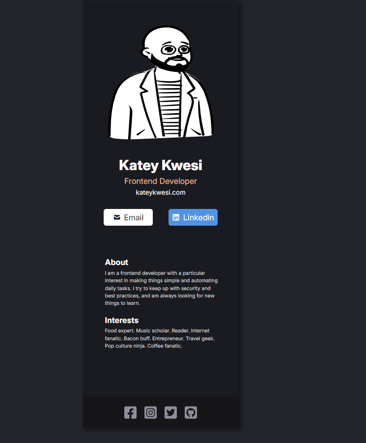

# 💼 Digital Business Card

A clean and responsive **React-based digital business card** built as my **first React project**.  
This project was inspired by Scrimba’s React course and designed to showcase how JSX, and component structure work together to build simple UI apps.

---

## 🚀 Project Linke

🔗 **[Figma](https://www.figma.com/design/ZY9TcbjABs5ZVokr47uiSW/Digital-Business-Card--Copy-?node-id=0-1&t=YtppJdsx5uxtG8lX-1)**

---

## 🧩 Features

✅ Built with React (using functional components)  
✅ Organized folder structure  
✅ Responsive card layout  
✅ Dark mode aesthetic  
✅ Interactive social links and contact buttons  
✅ Styled with custom CSS

---

## 🛠️ Built With

- **React** (Create React App)
- **CSS3** (custom styling)
- **Figma** (for layout inspiration)

---

## 🧠 What I Learned

- Setting up a React environment using **Create React App**
- Writing and structuring components
- Using **JSX** syntax for markup inside JavaScript
- Styling React components with plain CSS
- Deploying a simple React app

---
